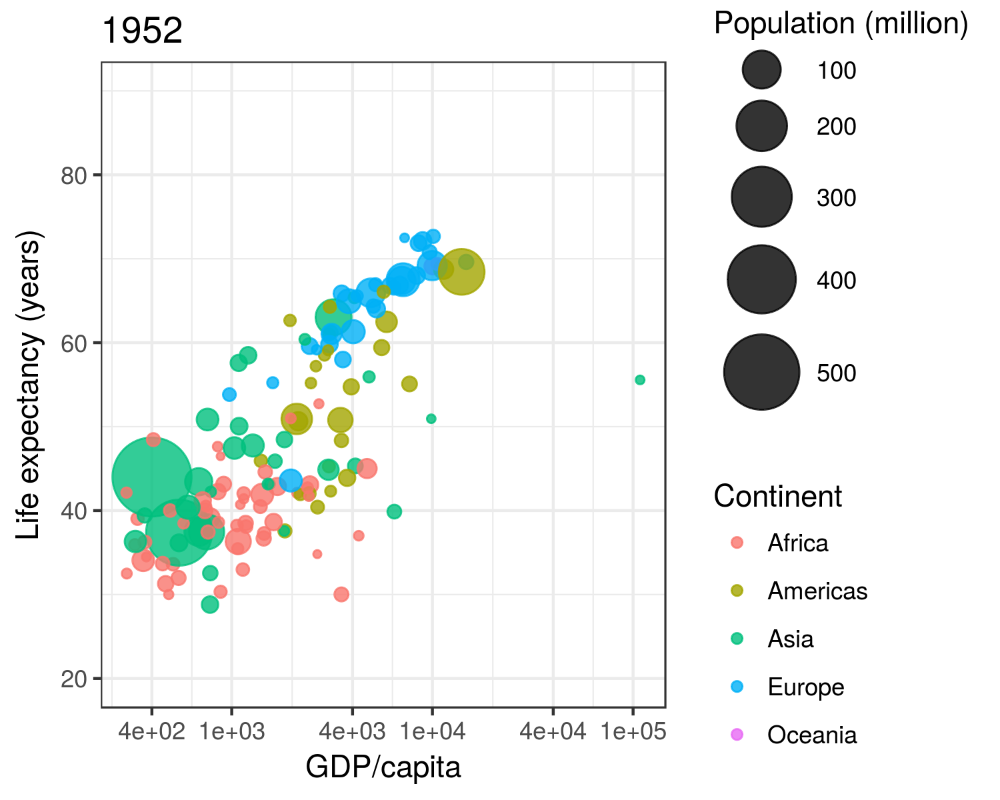
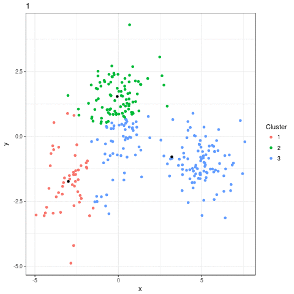

```{r setup, include=FALSE}
knitr::opts_chunk$set(echo=TRUE, eval=TRUE, cache=TRUE)
# eval=TRUE for actually run 
```
# イントロ  

## だれ？  

<div class="column1">

- fuuuumin @twitter
(fuuumin314)
- R歴 3年
- 大学卒業間近

</div>

<div class="column2" style="float: right;">


</div>

# グラフを動かしたくないですか？

## どうやって？ 

- 今回はgapminderデータを使います  

```{r, echo=FALSE, message=FALSE}
library(gapminder)
library(tidyverse, warn.conflicts=FALSE)
gapminder %>% 
    str() %>% 
    knitr::kable()

gapminder %>% 
    head() %>% 
    knitr::kable()
```

## 時系列のlineplotだと  

```{r, echo=FALSE}
theme_set(theme_bw())
gapminder %>% 
    ggplot(., aes(x=year, y=lifeExp, group=country, color=continent)) +
    geom_line() +
    labs(x="year", y="Life Expectancy (yrs)", title="Boring Line Plot")
```

意図が分からない  

# 動くグラフ

## 関数作って

- まずyearを引数にとる関数を作る  

```{r, eval=FALSE}
plot_by_year <- function(yr) {
    p <- gapminder %>% 
        dplyr::filter(year == yr) %>% 
        ggplot(aes(x=gdpPercap, y=lifeExp, 
                   size=pop / 1e+06, color=continent)) +
        ggtitle(paste0(yr)) +
        geom_point(alpha=.8) +
        scale_x_log10(breaks=c(400, 1000, 4000, 10000, 40000, 100000)) +
        ylim(c(20, 90)) +
        scale_size_continuous(range=c(1, 13)) +  
        labs(x="GDP/capita", 
             y="Life expectancy (years)", 
             color="Continent", 
             size="Population (million)")
    return(p)
}
```

## ループを回す

<div class="column1">

```{r, eval=FALSE}
plot_ls <- gapminder %>% 
    dplyr::distinct(year) %>% 
    dplyr::pull() %>%  
    map(., plot_by_year)

plot_ls[[1]]
```

ただし、ggplotは軸を自動調整して
しまうので手動で調整が必要

</div>

<div class="column2" style="float: right;>



画像を合成してgifなどに

</div>

## gganimateを使う

- インストールはGithubから
- 必要な要件をよく確認
- 裏でImageMagickが動くので、Windowsは注意

`devtools::install_github("dgrtwo/gganimate")`

## tweenr で補完

- 滑らかなアニメーションのため

```{r, eval=TRUE}
library(gganimate)
library(tweenr)
tw <- gapminder %>% 
    split(.$year) %>%  ## list of dfs by year 
    tweenr::tween_states(tweenlength=5, statelength=0, 
                         ease="cubic-in-out", nframes=200) %>% 
    dplyr::mutate(yr = floor(year))
```

```{r, eval=TRUE, echo=FALSE}
tw %>% 
    dplyr::filter(country == "Japan") %>% 
    head()
```

```{r, eval=FALSE, echo=FALSE}
# Actual code
tw_yr <- tw %>%
    select(yr, continent, pop, .frame) %>% 
    mutate(xpos = c(Inf)) %>% 
    mutate(ypos = c(-Inf)) %>% 
    mutate(hjustvar = 1) %>% 
    mutate(vjustvar = 0)
```

## 

- アニメーションを作るコード

```{r, eval=FALSE}
anim <- ggplot(tw, aes(gdpPercap, lifeExp, size=pop / 1e+06, 
                       color=continent, frame=.frame)) + ...

gganimate(anim, interval=.1, title_frame=FALSE, 
          filename="./tmp/gapminder.gif")
```

```{r, eval=FALSE, echo=FALSE}
# Actual code
anim <- ggplot(tw, aes(gdpPercap, lifeExp, size=pop / 1e+06, color=continent, frame=.frame)) +
        geom_point(alpha=.8) +
        geom_text(data=tw_yr, aes(x=xpos, y=ypos, hjust=hjustvar, vjust=vjustvar, label=yr), 
                  size=18, color="black", show.legend=FALSE) +
        scale_x_log10(breaks=c(400, 1000, 4000, 10000, 40000, 100000)) +
        scale_size_continuous(range=c(1, 13)) +  ## maps size to the area of circle rather than radius
        labs(x="GDP/capita", 
             y="Life expectancy (years)", 
             color="Continent", 
             size="Population (million)") 

gganimate(anim, interval=.1, title_frame=FALSE, filename="./img/gapminder_anim.gif")
```

##


## k-means

```{r, eval=FALSE, echo=FALSE}
# Not so efficient code
set.seed(100)
centers <- data.frame(cluster=factor(1:3), size=c(100, 150, 50), 
                      x1=c(5, 0, -3), x2=c(-1, 1, -2))

points <- centers %>% 
    group_by(cluster) %>%
    do(data.frame(x1=rnorm(.$size[1], .$x1[1]),
                  x2=rnorm(.$size[1], .$x2[1])))

# from https://www.r-bloggers.com/machine-learning-explained-kmeans/
kmeans <- function(data, K=3, stop_crit=10e-5, it_max=10 ) {
  #Initialisation of clusters
  centroids <- data[sample.int(nrow(data), K), ]
  current_stop_crit <- 1000
  cluster <- rep(0, nrow(data))
  converged <- FALSE
  sample_df <- data.frame()
  centroids_df <- data.frame()
  it <- 1
  while(current_stop_crit >= stop_crit & converged == FALSE & it <= it_max) {
    if (current_stop_crit <= stop_crit) {
      converged <- TRUE
    }
    old_centroids <- centroids
    ## Assigning each point to a centroid
    for (i in 1:nrow(data)) {
      min_dist <- 10e10
      for (centroid in 1:nrow(centroids)) {
        distance_to_centroid <- sum((centroids[centroid, ] - data[i, ]) ^ 2)
        if (distance_to_centroid <= min_dist) {
          cluster[i] <- centroid
          min_dist <- distance_to_centroid
        }
      }
    }
    ##Assigning each point to a centroid
    for (i in 1:nrow(centroids)) {
        centroids[i,] <- apply(data[cluster==i, ], 2, mean)
    }
    current_stop_crit <- mean((old_centroids - centroids) ^ 2)

    sample_df_tmp <- data.frame(data, cluster, fr = as.integer(rep(it, nrow(data))))
    sample_df <- rbind.data.frame(sample_df, sample_df_tmp)
    centroids_df_tmp <- data.frame(centroids, fr = as.integer(rep(it, nrow(centroids))), shape=c(1:3))
    centroids_df <- rbind.data.frame(centroids_df, centroids_df_tmp)
    it <- it + 1
    }
  return(list(data=sample_df, centroids=centroids_df))
}

res <- kmeans(points[, -1])

# Plotting
kmeans_anim <- ggplot(data=res$data, aes(x1, x2, color=as.factor(cluster), frame=as.integer(fr))) + 
    geom_point() +
    geom_point(data=res$centroids, aes(x1, x2, frame=fr), color="black") +
    labs(x="x", y="y", color="Cluster") 

kmeans_anim

gganimate(kmeans_anim, interval=.5, title_frame=TRUE, filename="./img/kmeans.gif")

```



# 結論

## グラフが動くとなにが嬉しい？
- 暗にグラフに第三の軸を付け加えられる
- 聴衆を飽きさせない
- カッコいい(大事)

## どんなときに使える？
- 時間軸を組み込みたいとき
- アルゴリズムなど変化を強調するとき
- 実況風にプレゼンしたいとき

# 参考資料など

## reference
- [gganimate - github](https://github.com/dgrtwo/gganimate)

- [PLOTCON 2016: David Robinson, gganimate](https://www.youtube.com/watch?v=9Y7Y1s4-VdAce)

- [チェスの動きの可視化](https://rpubs.com/dgrtwo/chess)

## 環境

```{r}
devtools::session_info()[[1]]
```

## 

```{r}
devtools::session_info()[[2]]
```

